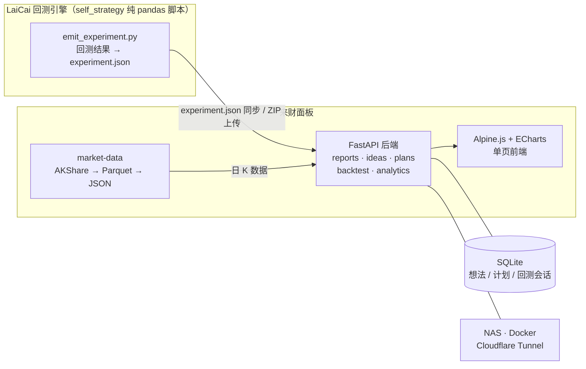

<div align="center">


# 来财 · 策略协作面板

**两人异步协作的期货量化策略面板 —— 把「口头 + 截图 + 聊天记录」换成「同一个网页面板读写」。**

<a href="backend/requirements.txt"></a>
<a href="backend/app/main.py"></a>
<a href="backend/app/database.py"></a>
<a href="frontend/index.html"></a>
<a href="deploy/docker-compose.yml"></a>
<a href="market-data/"></a>

[特性](#-特性) · [快速开始](#-快速开始) · [工作方式](#-它是怎么工作的) · [接入回测](#-接入-laicai-回测) · [数据管线](#-market-data-数据管线) · [部署](#️-部署到-nas) · [路线图](#️-路线图)

</div>

---

## ✨ 特性

- 📊 **回测报告中心** — 指标卡、收益曲线、逐笔交易明细与收益率明细，策略参数以中文释义表格呈现；支持星标标记与筛选
- 🕯️ **逐笔交易 K 线复盘** — 交易选择器 + K 线 + 布林三轨 + 开/平仓、左峰、触发位标注；K 线为 AKShare 拉取的真实行情，与回测同源
- 🧪 **回测中心** — 在面板里调参、选数据、一键运行回测，结果按会话归档管理、支持导入历史实验
- 💡 **策略想法 / 交易计划** — SQLite 持久化的 CRUD，把散落在聊天记录里的想法和计划变成可追踪的看板
- 🔬 **统计分析报告** — 平行度积分回归拟合（百分比归一化）、盈利单最大浮亏、峰值比例、止损与触发时点等分析，支持评论与星标
- 🗄️ **market-data 数据管线** — AKShare 批量拉取日 K → Parquet store → JSON 导出 → 数据校验，覆盖 38+ 期货品种
- 🚢 **NAS 一键部署** — docker-compose + Cloudflare Tunnel 公网 HTTPS，无需公网 IP

## 🚀 快速开始

```bash
# 1. 安装后端依赖
cd backend
pip install -r requirements.txt

# 2. 启动后端（同时托管前端）
uvicorn app.main:app --reload --port 8000

# 3. 浏览器打开
#    http://localhost:8000       → 协作面板（自带一份真实回测的样例报告）
#    http://localhost:8000/docs  → API 文档（FastAPI 自带）
```

Windows 双击 [`start.bat`](start.bat) 即可完成同样的事。样例报告位于 `backend/data/experiments/`，盈亏数字来自真实回测，「逐笔复盘」的 K 线与布林带为真实行情（由 [`laicai-bridge/fetch_kline.py`](laicai-bridge/fetch_kline.py) 从 AKShare 拉取，开/平仓价与回测逐位吻合）。

<details>
<summary><b>刷新 / 补真实 K 线</b>（自动备份合成版到 <code>.synth.bak</code>，按报告参数重算布林带）</summary>

```bash
cd laicai-bridge
python fetch_kline.py                                                    # 刷新所有报告
python fetch_kline.py --symbol AG2606 --from 2025-10-01 --to 2025-12-01  # 单独预览某合约
```

AKShare 免费、无需 token，`pip install akshare` 即用；上期所 4 位 / 郑商所 3 位年月等不统一的代码格式会自动尝试候选 symbol。

</details>

## 🧩 它是怎么工作的



**关键边界**：面板与 LaiCai 解耦 —— LaiCai 负责跑回测、产出报告文件，面板只读文件；除最底层的回测数据消费外互不侵入。字段约定见 [`docs/experiment-schema.md`](docs/experiment-schema.md)。

## 🔌 接入 LaiCai 回测

1. 把 [`laicai-bridge/emit_experiment.py`](laicai-bridge/emit_experiment.py) 复制到 LaiCai 的 `pyStrategy/self_strategy/`；
2. 在回测脚本末尾加两行（详见 [`laicai-bridge/README.md`](laicai-bridge/README.md)）：

   ```python
   from emit_experiment import emit_experiment
   emit_experiment(instruments=all_results, strategy_name="...",
                   strategy_type="...", direction="short",
                   params={...}, out_dir="~/Desktop/experiments")
   ```

3. 跑完回测，把生成的 `<experiment_id>/experiment.json` 整个目录拷到 `backend/data/experiments/` 下（大文件可在面板里用 ZIP 上传同步），刷新即可。

## 🗄️ market-data 数据管线

独立 venv、与 backend 隔离（依赖见 [`market-data/requirements-data.txt`](market-data/requirements-data.txt)）：

```bash
cd market-data
python -m src.cli fetch-daily --symbol RB2505,SN2506,MA2509  # 批量拉日K → Parquet store
python -m src.cli export --symbol RB2505 --period D1         # store → exports/D1 JSON
python -m src.cli validate --symbol RB2505 --period D1       # 数据校验
```

另有 `batch_fetch_all.py` / `batch_export_all.py` 批量脚本与 `sync_to_nas.py` 同步工具，详见 [`market-data/README.md`](market-data/README.md)。

## 🖥️ 部署到 NAS

```bash
cd deploy
docker compose up -d --build    # 面板跑在 NAS 的 8000 端口，自动重启
```

公网访问用 Cloudflare Tunnel（免费、自动 HTTPS、不用公网 IP），步骤见 [`deploy/cloudflared/README.md`](deploy/cloudflared/README.md)；完整指南见 [`deploy/NAS-DEPLOY-GUIDE.md`](deploy/NAS-DEPLOY-GUIDE.md) 与 [`docs/NAS功能适配指南.md`](docs/NAS功能适配指南.md)。

> ⚠️ **鉴权必做**：面板本身不带登录。**暴露到公网前必须先配置 Cloudflare Access（或其它鉴权）**，否则任何拿到链接的人都能看到你全部回测策略、品种和盈亏。推荐 Cloudflare Access（免费零信任，邮箱白名单即可）。

## 📁 项目结构

```text
TelecomQt/
├── backend/                  FastAPI 后端（API + 托管前端 + 回测引擎）
│   ├── app/
│   │   ├── routers/          reports · ideas · plans · backtest · analytics · data_sync · symbols
│   │   ├── backtest_engine.py    回测引擎（被回测中心调用）
│   │   └── report_loader.py      实验报告扫描与加载
│   ├── data/                 运行时数据（experiments 实验报告 · SQLite · analytics 分析脚本）
│   ├── Dockerfile
│   └── requirements.txt
├── frontend/                 单页 H5（Alpine.js + ECharts，依赖已本地 vendored 到 assets/）
├── laicai-bridge/            LaiCai → experiment.json 适配器
│                             （emit_experiment / build_chart / fetch_kline / double_top_backtest）
├── market-data/              日 K 数据管线（AKShare → Parquet store → JSON 导出 → 校验）
├── deploy/                   docker-compose · Cloudflare Tunnel · Gitea 私有仓库
├── docs/                     设计方案 · experiment.json 字段约定 · 算法说明
├── start.bat                 Windows 一键启动
└── publish_experiment.bat    一键发布实验报告到面板
```

<details>
<summary><b>📄 文档索引</b></summary>

| 文档 | 内容 |
|---|---|
| [`docs/设计方案.md`](docs/设计方案.md) | 项目定位、整体架构与技术选型 |
| [`docs/回测中心设计方案.md`](docs/回测中心设计方案.md) | 面板内交互式回测的设计与参数全景 |
| [`docs/平行度积分拟合算法.md`](docs/平行度积分拟合算法.md) | 平行度门控算法（积分回归拟合 + 百分比归一化） |
| [`docs/experiment-schema.md`](docs/experiment-schema.md) | experiment.json 字段约定 |
| [`docs/NAS功能适配指南.md`](docs/NAS功能适配指南.md) / [`deploy/NAS-DEPLOY-GUIDE.md`](deploy/NAS-DEPLOY-GUIDE.md) | NAS 部署与适配 |
| [`deploy/DATA-SYNC-GUIDE.md`](deploy/DATA-SYNC-GUIDE.md) | 实验数据同步（含 ZIP 上传） |
| [`laicai-bridge/README.md`](laicai-bridge/README.md) · [`market-data/README.md`](market-data/README.md) | 桥接层与数据管线详细用法 |

</details>

## 🗺️ 路线图

| 里程碑 | 内容 | 状态 |
|---|---|---|
| M1 | 回测报告中心（指标卡 / 收益曲线 / 逐笔明细 / 星标） | ✅ |
| M1.5 | 逐笔交易 K 线复盘（布林三轨 + 开平仓 / 左峰 / 触发位标注） | ✅ |
| M2 | 策略想法 + 交易计划 CRUD（SQLite） | ✅ |
| M2.5 | 回测中心（面板内调参 + 一键回测 + 会话归档管理） | ✅ |
| M3 | PWA + Cloudflare Access 鉴权 + 正式上线 | 待做 |

---

<div align="center">
<sub>来财 —— 让每一次回测都有处可查、有据可循。</sub>
</div>
