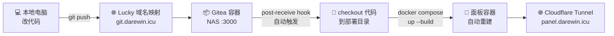

# Gitea 一键自动部署方案

> **目标**：本地改代码 → `git push` → NAS 自动拉取代码 + Docker 重建 → 面板自动更新。全程无需 SSH 到 NAS。

---

## 架构概览



**核心机制**：
1. Gitea 收到 push → 触发 `post-receive` Git Hook
2. Hook 脚本把代码 checkout 到项目部署目录
3. Hook 脚本通过 Docker socket 执行 `docker compose up -d --build`
4. 面板容器重建完成，自动恢复服务

**为什么不用 Webhook 接收器？**
`post-receive` 是 Git 原生机制，在 Gitea 容器内直接执行，不需要额外部署 webhook 接收服务，架构最简。唯一前提是 Gitea 容器需要 Docker CLI（通过自定义镜像解决）。

---

## 前提条件

| 条件 | 说明 |
|------|------|
| NAS 支持 Docker + Compose | 绿联 DXP4800 PLUS ✅（UGOS Pro 内置 Docker 管理器） |
| Lucky 端口映射 | 把 Gitea 的 Web 端口映射到公网域名 |
| 已有 Cloudflare Tunnel | 面板本身已通过 Tunnel 暴露到 `panel.darewin.icu` |
| NAS 能 build Docker 镜像 | 绿联 Docker 管理器的「Compose 项目」功能或终端均可 |

---

## 实施步骤

### 第 1 步：把配置文件放到 NAS 上

把项目中的 `deploy/gitea/` 目录整体上传到 NAS（通过文件管理器、网盘同步均可）。

假设放在 NAS 的 `/share/TelecomQt/deploy/gitea/` 下。

**修改 `docker-compose.yml` 中的项目路径**：

打开 `deploy/gitea/docker-compose.yml`，找到这行：

```yaml
- /share/TelecomQt:/share/TelecomQt
```

把它改成你 NAS 上 TelecomQt 项目的实际路径。例如：

```yaml
# 绿联 NAS 示例（具体路径以你的实际情况为准）
- /share/TelecomQt:/share/TelecomQt
# 或
- /volume1/TelecomQt:/volume1/TelecomQt
```

> ⚠️ **路径一致性是关键**：容器内和宿主机的路径必须完全相同。这是因为 `docker compose` 在容器内执行时，它解析的 `context: ..` 等相对路径最终需要映射到宿主机上真实存在的目录。

同时修改 `post-receive.sh` 中的路径（保持一致）：

```bash
DEPLOY_DIR=/share/TelecomQt   # ← 与上面的路径一致
```

### 第 2 步：启动 Gitea

**方式 A：通过绿联 Docker 管理器的 Compose 功能**
1. 打开绿联 NAS 的 Docker 管理器
2. 找到「Compose」或「项目」功能
3. 新建项目，选择 `deploy/gitea/` 目录
4. 点击「构建」或「启动」

**方式 B：通过 NAS 终端**
```bash
# 如果绿联 NAS 有终端功能（Web UI 中的命令行）
cd /share/TelecomQt/deploy/gitea
docker compose up -d --build
```

首次启动会自动 build 自定义 Gitea 镜像（加 Docker CLI），约 1-2 分钟。

### 第 3 步：初始化 Gitea

1. 浏览器打开 `http://NAS内网IP:3000`
2. 按引导完成初始设置（数据库选 SQLite，其他默认即可）
3. 注册管理员账号
4. 创建仓库：`TelecomQt`（**空仓库，不要勾选初始化 README**）

### 第 4 步：配置 Lucky 域名映射

在 Lucky 中添加映射：

| 内部地址 | 外部域名 | 用途 |
|----------|---------|------|
| `NAS_IP:3000` | `git.darewin.icu` | 本地 `git push` + Gitea Web UI |

> **HTTPS**：建议用 Lucky 给 `git.darewin.icu` 配上 Let's Encrypt 证书，否则 `git push` 时会报证书警告。或者用 `git config --global http.sslVerify false` 临时关闭（不推荐长期使用）。

### 第 5 步：本地配置 Git Remote

```bash
cd D:\workstations\TelecomQt

# 添加 NAS Gitea 为远程仓库（不影响已有的 GitHub origin）
git remote add nas https://git.darewin.icu/WUJinda/TelecomQt.git

# 推送代码
git push nas main
```

> 如果 Gitea 的仓库是私有的，首次 push 会提示输入用户名和密码（Gitea 的访问令牌）。

### 第 6 步：配置 post-receive Hook（关键）

1. 打开 Gitea Web UI → 进入 TelecomQt 仓库
2. **Settings → Git Hooks → `post-receive`**
3. 把 `deploy/gitea/post-receive.sh` 的内容**完整粘贴**进去
4. 确保 `DEPLOY_DIR` 路径已修改正确
5. 点击 **Save Hook**

### 第 7 步：验证

```bash
# 本地随便改点东西，push 试试
echo "<!-- test deploy -->" >> frontend/index.html
git add -A && git commit -m "test: 验证自动部署"
git push nas main
```

push 完成后，Gitea 的 push 输出中应该能看到部署脚本的日志（✅ 代码已更新 → ✅ Docker 镜像已重建 → 🎉 部署完成）。

也可以在 Gitea Web UI → 仓库 → **Activity** 页查看推送记录。

---

## 日常使用

### 日常开发流程（两条命令）

```bash
# 改完代码后
git add -A && git commit -m "feat: 你的改动"

# 推送到 NAS（自动触发部署）
git push nas main
```

推送后约 30-60 秒，`https://panel.darewin.icu` 就是最新版本。

### 同时推送到 GitHub 和 NAS

```bash
# 一次性推送两个远程
git push origin main && git push nas main

# 或者配置为同时推送（可选）
git remote set-url --add --push origin https://github.com/WUJinda/TelecomQt.git
git remote set-url --add --push origin https://git.darewin.icu/WUJinda/TelecomQt.git
# 之后 git push 会同时推到两边
```

### 手动重新部署（不通过 push）

如果代码没变但想重建容器（比如 Docker 配置改了）：

```bash
# SSH 到 NAS（如果能的话）或在 NAS 终端
cd /share/TelecomQt/deploy
docker compose up -d --build panel
```

---

## 配置文件说明

| 文件 | 位置 | 用途 |
|------|------|------|
| `Dockerfile.gitea` | `deploy/gitea/` | 自定义 Gitea 镜像（官方 + docker CLI） |
| `docker-compose.yml` | `deploy/gitea/` | Gitea 容器编排（含 Docker socket + 项目目录挂载） |
| `post-receive.sh` | `deploy/gitea/` | Git Hook 脚本（粘贴到 Gitea Web UI 的 Git Hooks 配置中） |

### 关键配置项

**`docker-compose.yml` 中的 Docker socket 挂载**：
```yaml
- /var/run/docker.sock:/var/run/docker.sock
```
让 Gitea 容器能通过 socket 控制 NAS 上的 Docker daemon。`post-receive` hook 执行 `docker compose` 命令时，实际调用的是宿主机的 Docker。

**`docker-compose.yml` 中的路径一致性挂载**：
```yaml
- /share/TelecomQt:/share/TelecomQt
```
容器内外的路径完全相同。这样 `docker compose` 解析 `context: ..` 等相对路径时，宿主机 Docker daemon 能找到正确的文件。

---

## 故障排查

### push 后没有触发部署

1. **检查 Hook 是否保存**：Gitea → Settings → Git Hooks → post-receive，确认有内容
2. **检查路径**：`post-receive.sh` 中的 `DEPLOY_DIR` 与 `docker-compose.yml` 中的挂载路径是否一致
3. **手动测试 Hook**：在 Gitea 容器内手动执行 hook 脚本，看是否报错

### `docker compose` 命令执行失败

```bash
# 进入 Gitea 容器检查 docker CLI 是否可用
docker exec -it gitea docker version

# 检查 Docker socket 是否挂载成功
docker exec -it gitea ls -la /var/run/docker.sock
```

如果 `docker version` 报错，可能是：
- 自定义镜像没有正确 build（检查 Dockerfile.gitea）
- Docker socket 没有正确挂载（检查 docker-compose.yml）

### checkout 的代码不完整

`git --work-tree` checkout 默认只包含 git 追踪的文件。`.gitignore` 排除的文件（如 `.venv/`、`backend/data/`）不会被 checkout，这是正常的——这些文件由 Docker volume 挂载提供。

### 面板健康检查失败

```bash
cd /share/TelecomQt/deploy
docker compose logs --tail=50 panel
```

常见原因：
- Python 依赖安装失败（检查 `backend/requirements.txt`）
- 端口冲突（8000 被其他程序占用）
- 数据文件缺失（首次部署需要先放实验数据）

---

## 安全注意事项

| 风险 | 措施 |
|------|------|
| Docker socket 暴露 | Gitea 容器挂载 Docker socket 意味着它能控制所有容器。确保 Gitea 管理员账号只有你自己知道 |
| Gitea 端口暴露 | Lucky 映射的 `git.darewin.icu` 建议配 HTTPS。Gitea 的仓库设为私有 |
| 代码泄露 | Gitea 仓库设为 Private，防止代码被公开访问 |
| 部署目录权限 | 确保 Gitea 容器的用户（UID 1000）有权限写入部署目录 |

---

## 与现有部署方式对比

| | 手动部署（NAS-DEPLOY.md） | Gitea 自动部署（本方案） |
|--|------------------------|----------------------|
| **代码同步** | rsync 手动拷贝 | `git push nas main` |
| **部署触发** | SSH + 手动 `docker compose up` | push 后自动触发 |
| **版本管理** | 无 | 完整 Git 历史，可回滚 |
| **网络要求** | SSH 到 NAS | 仅 HTTPS |
| **初始配置** | 5 分钟 | 30 分钟（一次性） |
| **日常操作** | 3-4 步 | 1 条命令 |
